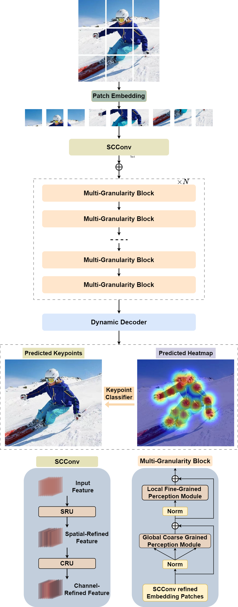
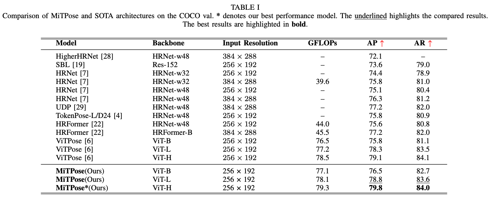

## MiTPOSE: Multi-Granularity guided Vision Transformer for Human Pose Estimation
> **Authors:** Yunfeng Wu, Qizhong Gao, Yize Liu, Jun Sun, Zhuozhi Li, Yuhao Jin, Yong Yue, Xiaohui Zhu*
> **Affiliations:** Xi’an Jiaotong-Liverpool University, University of Liverpool
### Introduction
Two-dimensional human pose estimation (HPE) has been widely used in behavioral analysis, identity verification, and automated industrial manufacturing. Compared to convolutional neural networks (CNNs), Vision Transformers (ViTs) have recently shown strong potential for human pose estimation. However, there are two key challenges:

1. The computational and parameter complexity of standard ViTs grows quadratically with image size, making them difficult to deploy on resource-constrained edge devices.
2. The vanilla self-attention mechanism in transformers lacks local fine-grained perception, which is crucial for precise keypoint localization.

To address these issues, we propose **MiTPOSE** (Multi-Granularity guided Vision Transformer for human pose estimation), a hybrid CNN–Transformer framework that combines the strengths of both architectures.

### Overall Framework

MiTPOSE first encodes the input image using an improved **SCConv**-based CNN backbone with **Global Response Normalization (GRN)**. The encoder is composed of a spatial reconstruction unit and a channel reconstruction unit, which together reduce redundant computation while enhancing feature representation. On top of this hybrid encoder, we introduce a novel **Multi-Granularity block** to compensate for the limitations of standard self-attention by explicitly modeling local fine-grained details at multiple spatial granularities. Finally, a lightweight decoder is employed to produce accurate keypoint heatmaps with low computational overhead.

<div align="center">
  


</div>

### Key Features

- **Hybrid CNN–Transformer Encoder**  
  Combines an improved SCConv backbone with GRN to balance efficiency and representation power, making MiTPOSE more suitable for edge deployment.

- **Multi-Granularity Attention Block**  
  Enhances local fine-grained perception that vanilla self-attention struggles to capture, improving keypoint localization accuracy.

- **Lightweight Decoder for Keypoint Detection**  
  A simple yet effective decoder that maintains competitive accuracy while keeping computation and parameters low.

### Experimental Results on COCO

We conduct comprehensive experiments on the COCO benchmark to validate the effectiveness of MiTPOSE. The results show that MiTPOSE achieves competitive or superior performance compared to state-of-the-art methods, while maintaining a significantly more efficient design in terms of parameters and FLOPs.

<div align="center">
  
**Overall results on COCO val**



**Overall results on COCO test-dev**


### Usage (MMPose Integration)

To reproduce our results or plug MiTPOSE into your own pipelines, we follow the standard **MMPose** framework and replace the backbone with our implementation.

#### 1. Install environment (MMPose)

Please first install MMPose and its dependencies by following the official instructions:

- MMPose installation guide: https://github.com/open-mmlab/mmpose

In short, this typically includes:

```bash
# create and activate a conda environment (example)
conda create -n mmpose python=3.10 -y
conda activate mmpose

# install PyTorch (choose the version & CUDA according to your environment)
pip install torch torchvision torchaudio

# install MMCV, MMEngine, and MMPose following the official docs
pip install -U openmim
mim install "mmengine>=0.7.0"
mim install "mmcv>=2.0.0"
mim install "mmpose"
```
#### 2. Change Backbone

Our backbone implementation is located at: MiTPose/codes/vision_transformer(mitpose).py


</div>
